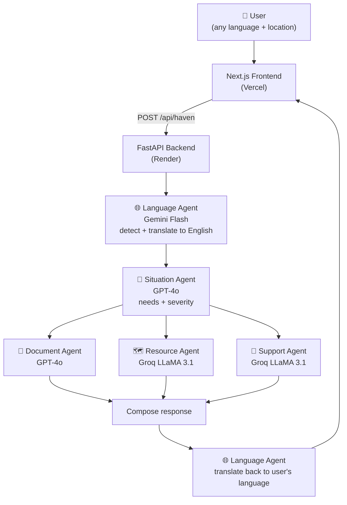

<div align="center">

# 🕊️ HavenAI

### *AI-powered refuge for the displaced*

**An intelligent multi-agent platform that helps refugees and displaced people get immediate assistance — translating their situation, generating official documents, finding nearby support services, and providing emotional guidance — all in their own language.**

Built solo in 10 hours for the **Hack-Nation Global AI Hackathon 2026** 🏆


</div>

---

## 💡 The Problem

Over **120 million people** worldwide are forcibly displaced. When someone arrives in a new country — exhausted, afraid, often speaking no local language — they face an impossible maze: Where do I sleep tonight? How do I ask for asylum? Who can treat my sick child? What do I even write in an official request?

**HavenAI answers all of that in under 30 seconds, in the person's own language.**

## ✨ What It Does

A person writes their situation in **any language**, shares their location, and five specialized AI agents work together:

| # | Agent | Model | Role |
|---|-------|-------|------|
| 1 | 🌐 **Language Agent** | Gemini Flash | Detects the user's language, translates to English, and translates the final answer back |
| 2 | 🧠 **Situation Agent** | GPT-4o | Deeply understands the situation, identifies urgent needs (food, shelter, medical, legal, safety), assesses severity |
| 3 | 📄 **Document Agent** | GPT-4o | Generates a formal assistance letter with fill-in placeholders, ready to present to authorities |
| 4 | 🗺️ **Resource Agent** | Groq LLaMA 3.1 | Finds UNHCR offices, food, shelter, legal aid and medical services near the user — with phone, location and website |
| 5 | 💙 **Support Agent** | Groq LLaMA 3.1 | A warm, personal two-paragraph message plus 3–5 clear, prioritized next steps |

**Resilient by design:** if any single agent fails, the pipeline continues with graceful fallbacks — the user always gets help.

**Fast by design:** the Document, Resource, and Support agents run **in parallel**, cutting response time to ~10s (typical) / ~20s (with document + translation).

## 🏗️ Architecture



## 🛠️ Tech Stack

- **Backend** — Python · FastAPI · Uvicorn · Pydantic
- **LLMs** — Google Gemini Flash (translation) · OpenAI GPT-4o (understanding + documents) · Groq LLaMA 3.1 8B (fast responses)
- **Frontend** — Next.js 16 · React 19 · TypeScript · Tailwind CSS 4 · Lucide icons
- **Deployment** — Render (backend) · Vercel (frontend)

## 🚀 Running Locally

### Backend

```bash
cd backend
python -m venv .venv
# Windows: .venv\Scripts\activate    macOS/Linux: source .venv/bin/activate
pip install -r requirements.txt

cp .env.example .env   # then paste your real API keys into .env

uvicorn main:app --reload --port 8000
```

Interactive API docs: http://localhost:8000/docs

**`backend/.env`:**

```
OPENAI_API_KEY=...
GEMINI_API_KEY=...
GROQ_API_KEY=...
```

### Frontend

```bash
cd frontend
npm install
cp .env.example .env.local   # defaults to http://localhost:8000

npm run dev
```

Open http://localhost:3000

## 📡 API Reference

### `GET /api/health`

Health check → `{"status": "ok"}`

### `POST /api/haven`

Runs the full 5-agent pipeline.

<details>
<summary><b>Example request</b></summary>

```json
{
  "message": "أحتاج مساعدة. أنا لاجئ مع عائلتي ولا نملك طعاماً أو مأوى.",
  "location": "Peshawar, Pakistan",
  "language": "auto",
  "need_document": true
}
```

</details>

<details>
<summary><b>Example response (abridged)</b></summary>

```json
{
  "detected_language": "Arabic",
  "translated_input": "I need help. I am a refugee with my family and we have no food or shelter.",
  "situation_summary": "A refugee family in Peshawar currently lacks food and shelter...",
  "urgent_needs": ["food", "shelter"],
  "severity": "high",
  "generated_document": "July 19, 2026\nPeshawar, Pakistan\n\nSubject: Request for Urgent Humanitarian Assistance...",
  "nearby_resources": [
    {
      "name": "UNHCR Pakistan",
      "type": "unhcr",
      "description": "Registers refugees and coordinates protection and aid.",
      "phone": "+92 51 921 1431",
      "location": "Islamabad",
      "website": "unhcr.org.pk",
      "contact": "Visit the office or call during working hours"
    }
  ],
  "emotional_support": "You have been through so much...",
  "next_steps": ["Register at the nearest UNHCR office...", "..."],
  "final_response": "...",
  "response_in_user_language": "لقد مررت بالكثير..."
}
```

</details>

## ☁️ Deployment

| Piece | Platform | Setup |
|---|---|---|
| Backend | **Render** | One-click via [`render.yaml`](render.yaml) blueprint — just paste the 3 API keys. Health check on `/api/health`. |
| Frontend | **Vercel** | Import repo, root directory `frontend`, set `NEXT_PUBLIC_API_URL` to the Render URL. |

## 📁 Project Structure

```
haven_AI/
├── backend/
│   ├── agents/          # 5 agent implementations (one file each)
│   ├── api/routes.py    # Pipeline orchestration (parallel where possible)
│   ├── models/          # Pydantic request/response schemas
│   ├── prompts/         # Detailed system prompt per agent
│   ├── main.py          # FastAPI app
│   └── requirements.txt
├── frontend/
│   └── src/
│       ├── app/         # Next.js App Router pages
│       ├── components/  # Hero, InputSection, AgentPipeline, Results, Typewriter...
│       ├── lib/api.ts   # Typed API client
│       └── types/       # Shared TypeScript interfaces
└── render.yaml          # Render one-click blueprint
```

## ⚠️ Important Disclaimer

HavenAI provides **AI-generated guidance, not legal advice**. Organization contact details come from model knowledge and should be verified before relying on them. **If you are in immediate danger, contact local emergency services first.**

---

<div align="center">

Built with ❤️ by **Habib ur Rahman** for the Hack-Nation Global AI Hackathon 2026

*"You are not alone."*

</div>
